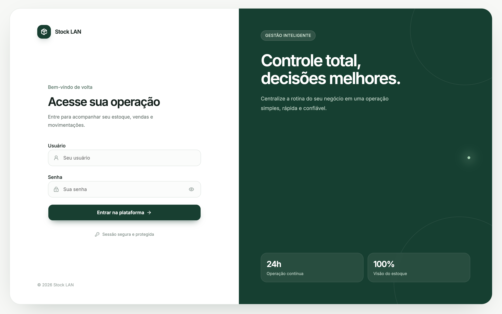

# 📦 stock-lan

Sistema de gestão de estoque: controle de matéria-prima, produtos acabados, vendas e relatórios.

<p>
  
  
  
  
  
  
  
  
  
  
  
</p>

## Preview




## Stack

| Camada | Tecnologias |
| --- | --- |
| Backend | Bun · Fastify 5 · Prisma 6 · PostgreSQL 16 · Redis 7 · Zod 4 · JWT (`@fastify/jwt`) |
| Frontend | Vite · React 19 · TanStack Router/Query · shadcn/ui · Tailwind CSS 4 |
| Infra | Docker Compose (API + Web + Postgres + Redis) |

## Requisitos

- [Bun](https://bun.sh) ≥ 1.3
- [Node.js](https://nodejs.org) ≥ 20
- Docker + Docker Compose (para Postgres/Redis locais ou deploy)
- [Nginx Proxy Manager](https://nginxproxymanager.com) (ou outro proxy reverso) apontando para a rede externa `proxy`, em produção

## Estrutura

```
stock-lan/
├── backend/    # API Fastify + Prisma (Bun)
├── frontend/   # SPA Vite + React
└── docker-compose.yml
```

## Como rodar (desenvolvimento)

Suba Postgres e Redis (ou aponte `DATABASE_URL`/`REDIS_URL` para instâncias existentes):

```bash
docker compose up -d stock-postgres redis
```

### Backend

```bash
cd backend
cp .env.example .env
bun install
bunx prisma generate
bunx prisma migrate dev
bun dev              # http://localhost:3333
```

Com `DOCS_ENABLED=true` no `.env`, os docs (Scalar) ficam em `http://localhost:3333/docs`.

### Frontend

```bash
cd frontend
cp .env.example .env
npm install
npm run dev          # http://localhost:5173
```

## Variáveis de ambiente

**`backend/.env`**

| Variável | Descrição |
| --- | --- |
| `DATABASE_URL` | Connection string do PostgreSQL |
| `REDIS_URL` | Connection string do Redis |
| `JWT_SECRET` / `JWT_REFRESH_SECRET` | Segredos dos tokens (mín. 32 caracteres) |
| `CORS_ORIGINS` | Origens permitidas, separadas por vírgula |
| `DOCS_ENABLED` | Habilita `/docs` (Scalar) e `/openapi.json` |

**`frontend/.env`**

| Variável | Descrição |
| --- | --- |
| `VITE_API_URL` | URL base da API consumida pelo frontend |

## Testes e lint

```bash
# backend
cd backend
bun test test/unit        # testes unitários
bun test --coverage        # cobertura
biome check .               # lint
tsc --noEmit                # typecheck

# frontend
cd frontend
npm run lint
npm run build               # typecheck real (tsc -b) + build
```

## Deploy (VPS via Docker Compose)

```bash
docker network create proxy   # só na primeira vez
docker compose --env-file frontend/.env up -d --build --force-recreate
```

- `backend/.env` e `frontend/.env` precisam existir (ver `.env.example` de cada um). Valores sem aspas em `backend/.env` - o Compose não interpreta aspas.
- `--env-file frontend/.env`: obrigatório, é de onde vem o `VITE_API_URL` do build.
- `--force-recreate`: Compose não recarrega `env_file` sozinho em containers existentes.
- `--build`: necessário sempre que mudar código ou `VITE_API_URL`.

Migração de banco em produção:

```bash
cd backend && bunx prisma migrate deploy
```
